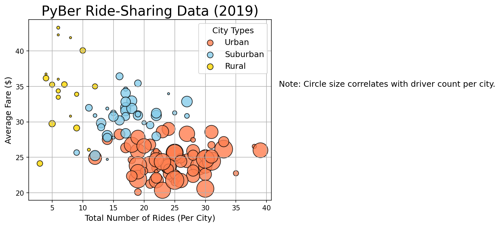

# PyBer with Matplotlib 

## Overview of Project

The project is in association with PyBer, a ride-sharing app company. The CEO, V. Isualize, would like for an analysis of the rideshare data from Janaury to early May of 2019, and compelling visualizations to accompany the analysis.

### Purpose

The project is meant to highlight relationships between the fares, number of rides, and number of drivers, in different kinds of cities. The goal is to present Pyber with an analysis that can aid them in improving access to their services and determine affordability for underserved neighborhoods.

---

## Resources

* Data Source: *city_data.csv* and *ride_data.csv* 
    

        
    
 

* Software: *Python 3.10.7, pandas 1.4.4, matplotlib 3.6.0, Jupyter Notebook 6.4.12*
    

        
    
 

---

## Results & Analysis

Here's a review of the results:

        
 
 

  

  

From the above bubble chart, we can infer that as the cities become more urbanized, the number of drivers increase, which makes sense considering the dense population of urban cities. So, it also makes sense why the total number of rides also increases with more urbanization. What is important to notice, however, is that the change in the average fare has an inverse relationship with the the change in the number of drivers/rides; this can be attributed to there being scarcity of PyBer's services in more rural and suburban cities, and thus, the cost of the service increases. However, it could also be attributed to a lower demand for PyBer's services in more rural and sububran cities. 

 

Let's validate this by observing the exact proportion of drivers in each type of city:

  

From the above pie chart, we observe that a vast majority of PyBer drivers are present in the urban cities. It is most likely the number of drivers that is driving an increase/decrease in the number of rides as well as the average amount of the fare. But how much is PyBer really affected by the increased average fare in less-urbanized cities?

 

Let's take a closer look at the total fares to answer that question:

  

Although, the average fare price is higher in the less urbanized cities, PyBer makes most of it's total revenue in the more urbanized cities. So, while PyBer's current business model isn't detrimental, it isn't exploring a potential area to expand into.

 

---

## Summary

From the above analysis, I can provide you with 3 recommendations:

1. We should extend the data gathered to also include rider input. While the pie chart showed that the lack of drivers in the less-urbanized cities caused a decreased amount of PyBer activity in those cities, we cannot for sure theorize that it may be the only factor. There may be a possibility such as people in rural areas and suburban areas not needing transportation to get somehwere, considering the size of such demographics and areas. In that case, there wouldn't really be a potential market for Pyber to venture into.

2. I would like to extend the range of analysis for the "Total Fare by City Type (2019)" chart. Total fares for urban and suburban cities increased by ~$1,000 over the course of 4 months, and I would like to observe whether this is a more an effect of a year-through phenomenon or a seasonal peak. This could help PyBer in identifying the right time for promotionals.

3. Lastly, to address the overarching purpose of this analysis, PyBer should increase the number of drivers in less urbanized areas. Irrespective of the root cause for a dryer market in rural and suburban cities, there exists a diminished access to our services. In order to improve access and subsequently determine affodability for such underserved neighborhoods, PyBer's most direct approach would be to raise more awareness of PyBer job openings and services in the less urbanized cities. 